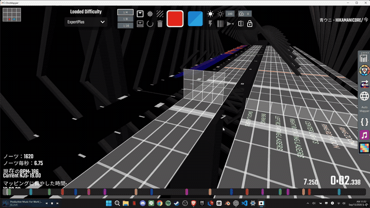

# PNG Wall for ChroMapper

PNG画像を色付きWallの集合へ変換するChroMapperプラグインです。画像の縦横比を保ちながら、最大辺のピクセル密度を4〜128で変更できます。


## デモ動画



ページ内で自動再生します（音声なし）。[音声付きの元動画（MP4）](https://github.com/CBQ57/Chromapper-PNG-to-Wall-Pluguin/releases/download/v1.0.0/yaju.mp4)

## ダウンロード

- [ChroMapper 0.12.874用ZIP](downloads/PngWall-CM0.12.874.zip)
- [ChroMapper 0.13.892用ZIP](downloads/PngWall-CM0.13.892.zip)

ZIP内の`Plugins/PngWall.dll`を本体の`Plugins`へコピーして再起動してください。両ZIPには同じ互換DLLが入っています。壁の不透明度の初期値は **0.05** です。（明るすぎると色がほぼ見えない）

## 機能一覧

- PNGの色をChroma Wallカラーとして保持
- 透明ピクセルをしきい値で除外
- PNGのアルファ値を保持。「壁の不透明度」で全体のアルファ値を調整（0=透明、1=元画像のまま）。除外しきい値は壁の薄さではなく生成対象の選別です。
- 最大辺ピクセル密度、1pxのサイズ、X/Y位置、開始Beat、奥行きを調整
- 初期値の数値を黄色で表示し、各設定ページの「初期値」ボタンでリセット
- ニアレスト／滑らか縮小を切り替え
- 初期状態では`fake`かつ当たり判定なしの装飾Wallを生成
- 生成1回分を`Ctrl+Z`で一括Undo
- 12,000 Wallの安全上限

## 対応

- ChroMapper 0.12.874 / 0.13.892
- Beatmap V2 / V3
- Chroma + Noodle Extensionsを使用するmodded譜面

Beatmap V4はChroma/Noodle Extensionsのカスタムデータを保持できないため、プラグイン側で生成を止めます。

## ビルド

.NET SDKがあれば通常ビルドを行います。SDKがないWindows環境では、付属の.NET Framework C#コンパイラへ自動的に切り替わります。

```powershell
.\build.ps1 -ChroMapperDir 'C:\Path\To\ChroMapper'
```

出力:

```text
dist\PngWall.zip
dist\PngWall-CM0.12.874.zip
dist\PngWall-CM0.13.892.zip
```

ビルドと同時にChroMapperへ配置する場合:

```powershell
.\build.ps1 -ChroMapperDir 'C:\Path\To\ChroMapper' -Deploy
```

または`PngWall.Plugin.csproj.user.example`を`PngWall.Plugin.csproj.user`へコピーし、`ChroMapperDir`を書き換えてVisual Studioからビルドできます。

## インストール

`PngWall.dll`をChroMapper本体の`Plugins`フォルダへ置き、ChroMapperを再起動します。エディター右側の拡張ボタンにカラフルなピクセルアイコンが追加されます。

## 使い方

1. V2またはV3の譜面をエディターで開きます。
2. 右側のPNG Wallアイコンを押します。
3. PNG画像を選びます。
4. 基本・配置・詳細の3画面で設定します。黄色の数値は初期値です。
5. 「Wallを生成」を押します。
6. 保存時にChromaとNoodle ExtensionsがRequirementsへ含まれることを確認します。

密度を上げるほど輪郭は細かくなりますが、Wall数と描画負荷も増えます。まず48前後で試すのがおすすめです。
